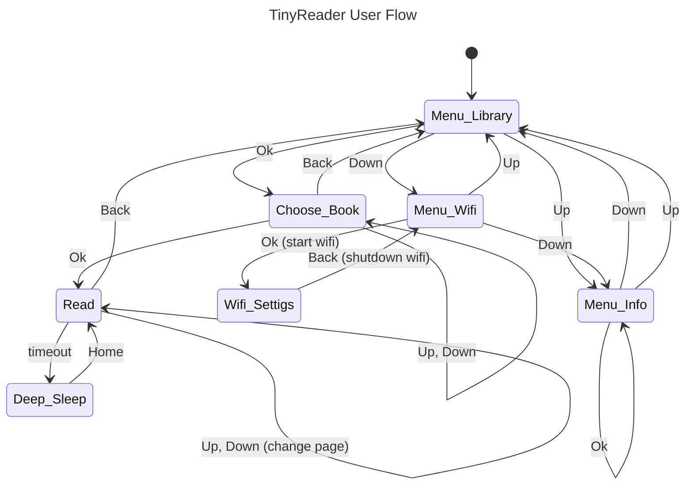

# TinyReader

> A pocket sized cheap e book reader

## TODO
- Delete book menu
- Go back without history need
- Better wifi ui
- Battery percentage real (not possible)
- Sleep screen
- Update only timer in wifi view

## Documentation

### Views
The menu on the left, with each option using an equal portion of vertical space. 
It's always visible, apart when in the `Read` view.
Buttons are rounded and becomes thicker when selected.

- `Read`: full screen read view, a single line is displayed, in n rows (e.g. 3).
- `Menu_Library` : on the right of the menu there is a list of books, none selected.
- `Menu_Wifi` : on the right of the menu there is a "wifi off" notice.
- `Menu_Info` : on the right of the menu there are some useful informations, like battery percentage
and storage used. `Ok` updates the view.
- `Wifi_Settings` : on the right of the menu there are wifi info (e.g. IP address, ssid, password)
along an updating uptime counter (partially refreshed).
- `Menu_Library` : on the right of the menu there is a list of available books. It can be navigated
with up and down, a book is selected with `Ok`. Each book is a button, there is a vertical progress
visualizer on the right, in case the books does not fit on the screen. Partial updates are used to
scroll up and down (highlight a different button and change right progress bar).
- `Deep_Sleep` : if occurred during `Read` restart from the same view, otherwise restart from the beginning.

- `Menu_Library`

### User flow

